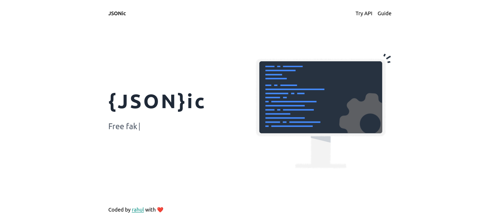

# JSONify

This project is a clone of JSONPlaceholder, which is a fake REST API for testing and prototyping. It provides a set of endpoints that return dummy data in JSON format. The purpose of this clone is to allow developers to locally test and develop their applications without relying on the external API.

## Table of contents

- [Overview](#overview)
  - [Screenshot](#screenshot)
  - [Links](#links)
- [My process](#my-process)
  - [Built with](#built-with)
  - [What I learned](#what-i-learned)
  - [Useful resources](#useful-resources)

## Overview

### Screenshot

### Links

- Live Site URL: [https://jsonify.vercel.app](https://jsonify.vercel.app)

## My process

### Built with

- [Next.js](https://nextjs.org/) - React Framework
- [Tailwind CSS](https://tailwindcss.com/) - For styles

### What I learned

- Next.js

### Useful resources

- [Next.js](https://nextjs.org/)
- [Tailwind CSS](https://tailwindcss.com/)
